# GridSpace

A minimalist Pebble watchface with a distinctive pixel-grid aesthetic. Every element—from time digits to status indicators—is rendered using a uniform grid of cells, creating a clean, geometric look.

## Screenshots
### Pebble Classic/Steel
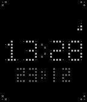
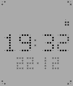

### Pebble Time/Time Steel

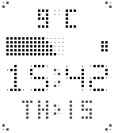

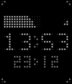
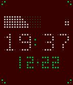

### Pebble Time Round
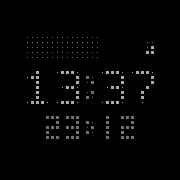
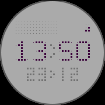

### Pebble 2/Duo
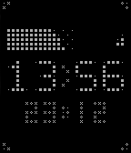
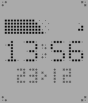

### Pebble Time 2
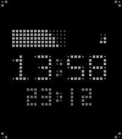
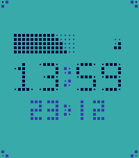
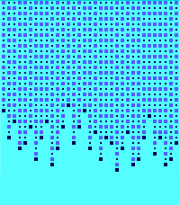

## Store
[Rebble App Store](https://apps.rebble.io/en_US/application/694a99bbfb639a000a570b91)

## Features

### Display Elements

- **Large Time Display**: Bold 5×7 digit patterns with customizable 12/24-hour format
- **Date Display**: Compact 3×5 digits below time with fully customizable left/right components
- **Step Tracker**: 5×15 diagonal progress bar showing daily step goal (requires health service)
- **Battery Indicator**: 2×3 grid showing battery level with top-down drain visualization 

### Visual System

- **Grid-Based Rendering**: All elements use 5×5 pixel cells (6×6 on Emery)
- **Two Cell Types**: Full cells (3×3px) and partial cells (1×1px) for depth
- **Three-Color System**:
  - Background color (default: black)
  - Foreground color (default: white) - main content
  - Secondary color (default: light gray) - accents and partial cells

### Customization

Access settings through the Pebble app:

- **Color Options**: Background, foreground, and secondary colors fully customizable
- **Step Goal**: Set target steps (1,000 - 50,000, default: 8,000)
- **Display Toggles**: Show/hide steps, battery, and date
- **Time Format**: 12-hour or 24-hour display
- **Date Format**: Customize left and right sides independently with these options:
  - Month Name
  - Week Day 
  - Week of the Year
  - Day
  - Month number
  - Year
- **Load Animation**: Pick a load animation: None, Wave Fill, Random Pop, Matrix

## Platform Support

- Aplite (144×168 B&W)
- Basalt (144×168 color)
- Chalk (180×180 round color)
- Diorite (144×168 B&W)
- Emery (200×228 color, enhanced 6×6 cells)

## License

MIT License - feel free to modify and share!

